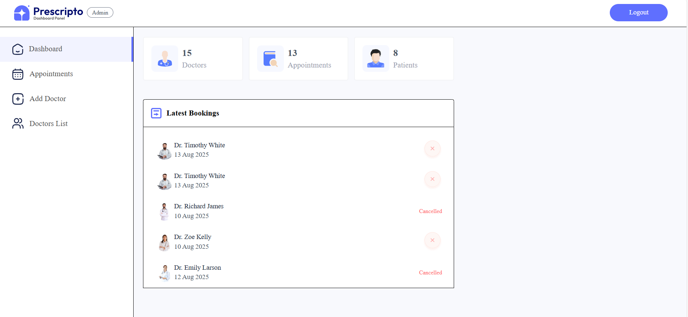
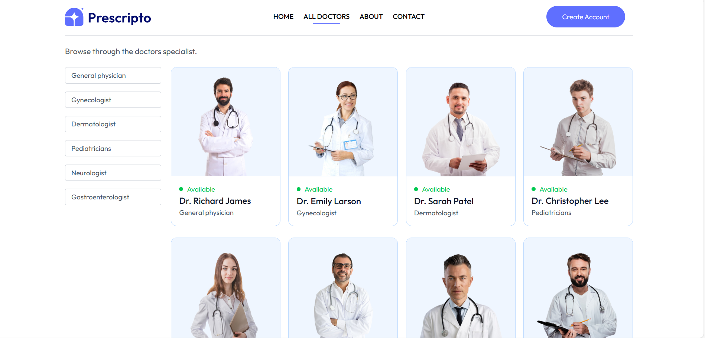

# Prescripto 🩺
*A Doctor Appointment Application with User, Doctor, and Admin Portals*

---

## 🌐 Live Demo
- **User Portal**: [https://prescripto-priya-frontend.vercel.app/]
- **Doctor Portal**:[ https://prescripto-management-app-priya-kum.vercel.app/]
- **Admin Portal**:  [https://prescripto-managemen-git-b365dd-priya-kumaris-projects-77f35f3b.vercel.app]

---

### 🔑 Demo Credentials
**User**  
- Email: `user.greatstack@prescripto.com`  
- Password: `12345678`  

**Admin**  
- Email: `admin@prescripto.com`  
- Password: `qwerty123`  

**Doctor**  
- Email: `doctor@prescripto.com`  
- Password: `qwerty123`  

---

## 📌 Overview
**Prescripto** is a full-stack Doctor Appointment Management application where users can:
- Create an account, log in, and book appointments with doctors of various specialties.
- Doctors can log in to manage and view their upcoming appointments.
- Admins can manage doctors, view all appointments, and cancel appointments if needed.

This project is built with **MongoDB, Node.js, Express, and React.js**.  
It features authentication, role-based portals, and is deployed via **Render**.

---

## 🚀 Features
✅ **User Portal** – Register/Login, search doctors, book appointments, view bookings  
✅ **Doctor Portal** – Secure login, view/manage appointments  
✅ **Admin Portal** – Manage doctors, view/cancel appointments, add new doctors  
✅ **Authentication & Authorization** – JWT-based secure login for all portals  
✅ **Responsive UI** – Works on desktop & mobile  
✅ **Specialty Filtering** – Find doctors by their specialty  
✅ **Cloud Storage for Images** – Doctors can have profile pictures via Cloudinary  

---

## 🛠 Tech Stack
- **Frontend:** React.js  
- **Backend:** Node.js, Express.js  
- **Database:** MongoDB  
- **Authentication:** JWT (JSON Web Tokens)  
- **Cloud Storage:** Cloudinary  
- **Deployment:** Render  

---

## 📸 Screenshots

### Home Page

### Admin Panel

### All Doctors Page

### Top Doctors Section

